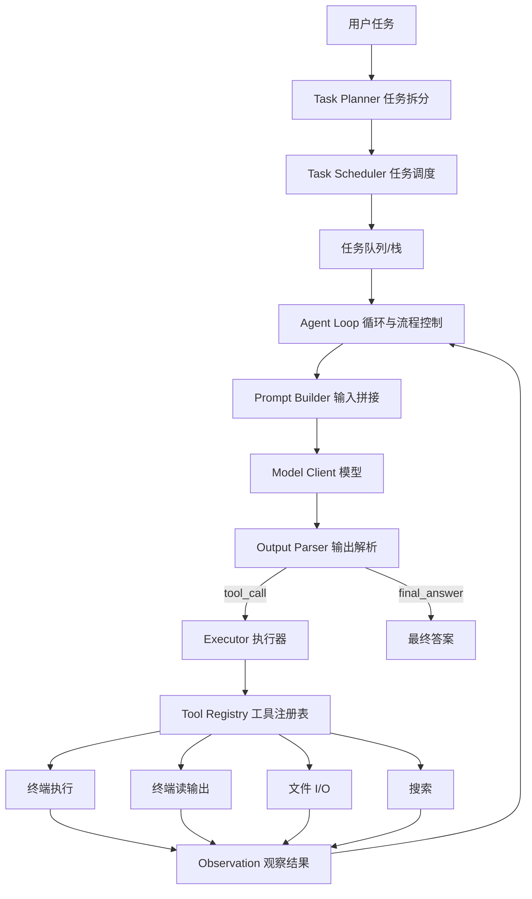

# Minimal SWE Agent 设计文档

- 版本：v0.1
- 日期：2026-08-24
- 作者：CS 学生（首版手写实现）
- 技术栈：TypeScript / Node.js

## 1. 项目概述

### 1.1 目标

实现一个 **最小可用** 的 SWE Agent（软件工程智能体）：给定一个自然语言的软件工程任务（修 bug、改代码、跑测试、读仓库等），Agent 能够自主地：

1. 把任务拆分成可执行的子任务；
2. 在受控的循环里逐步执行；
3. 按需调用工具（终端、文件读写、搜索等）；
4. 从工具结果中持续获取信息，最终给出结论或代码修改结果。

### 1.2 非目标（明确边界，避免过度设计）

- **不做**多 Agent 协作 / 分布式调度；
- **不做**复杂记忆系统（向量库、长期记忆），仅保留会话上下文与工作记忆；
- **不做**自动代码审查 / 强化学习训练；
- **不做**浏览器自动化、PR 提交等外部平台集成（作为后续扩展点）；
- **不做**多模型路由、Agent 框架通用化抽象——先让"单个 Agent 闭环"跑通。

### 1.3 设计原则

1. **单一闭环优先**：先保证 `LLM → 动作 → 工具 → 观察 → LLM` 这条链路稳定，再谈其他。
2. **强契约，弱实现**：LLM 输出、工具入参出参用清晰的结构化契约约束，内部实现可替换。
3. **可控可观测**：每一步都有 step 计数、超时、日志，便于调试和防死循环。
4. **跨平台**：终端工具需同时考虑 Windows（cmd/PowerShell）与 Unix（bash）。
5. **TypeScript 优先**：核心逻辑全部用 TS 实现，类型作为设计的一部分。

## 2. 技术栈与工程结构

### 2.1 技术选型

| 关注点 | 选择 | 说明 |
| --- | --- | --- |
| 运行时 | Node.js 20+ | 支持 ESM、原生 fetch |
| 语言 | TypeScript 5.x | 强类型约束 Agent 契约 |
| 终端 | `child_process`（最小）/ `node-pty`（推荐，持久会话） | 见 5.3 |
| 文件操作 | `node:fs/promises` | 原生 |
| 搜索 | 手写 glob + 正则 / `fast-glob` | 最小实现可手写 |
| 模型 | 可插拔 Model Client | OpenAI 兼容接口 / 本地模型 |

### 2.2 目录结构

```text
minimal-swe-agent/
├── package.json
├── tsconfig.json
├── .env.example
├── src/
│   ├── index.ts                 # 入口：装配所有组件并启动
│   ├── config.ts                # 配置项集中管理
│   ├── types.ts                 # 全局共享类型
│   ├── core/
│   │   ├── agent.ts             # 主循环（Agent 核心）
│   │   ├── task-planner.ts      # 任务拆分
│   │   ├── task-scheduler.ts    # 任务调度
│   │   ├── prompt-builder.ts    # 输入拼接
│   │   ├── output-parser.ts     # 输出解析
│   │   └── executor.ts          # 动作执行器
│   ├── model/
│   │   └── model-client.ts      # LLM 客户端封装
│   └── tools/
│       ├── types.ts             # Tool 接口定义
│       ├── registry.ts          # 工具注册表
│       ├── terminal.ts          # 终端执行 / 读输出
│       ├── file-io.ts           # 文件读写
│       └── search.ts            # 内容/文件名搜索
└── tests/                       # 单元测试（parser、tools）
```

## 3. 总体架构

### 3.1 架构图



### 3.2 组件职责一览

| 组件 | 职责 | 关键问题 |
| --- | --- | --- |
| Task Planner | 把高层任务拆成子任务树 | 拆多细？如何保证可执行？ |
| Task Scheduler | 决定"下一个做什么" | 顺序/栈/优先级 |
| Prompt Builder | 拼接 system + 历史 + 任务 + 工具 schema | 上下文窗口控制 |
| Output Parser | 把 LLM 文本解析为结构化动作 | 格式不合法怎么办 |
| Executor | 执行动作、调用工具、收集结果 | 超时/错误隔离 |
| Model Client | 统一调用 LLM | 可替换、可 mock |
| Tool Registry | 工具名 → 实现映射 | 工具描述如何喂给 LLM |

## 4. 核心模块设计

### 4.1 Task Scheduler（任务拆分与调度）

**目标**：把一个大的、模糊的任务转成有限个可执行的子任务，并按顺序派发给执行循环。

**两种拆分策略（首版建议先实现规则版，再实现 LLM 版）**

- **规则版（简单）**：不做智能拆分，把用户输入当作单个任务；仅提供一个可选的任务队列数据结构，未来再接入 LLM 拆分。
- **LLM 版（推荐）**：用一次独立的模型调用，让 LLM 输出一个 JSON 任务列表。

**任务数据结构**

```typescript
interface Task {
  id: string;
  description: string;          // 子任务目标，如 "定位报错的函数"
  status: "pending" | "in_progress" | "done" | "failed";
  parentId?: string;
  dependsOn?: string[];          // 依赖的前置任务（首版可忽略）
}
```

**调度规则（最小实现）**

1. 顶层任务入栈/入队；
2. 每次从栈顶弹出一个 `pending` 任务标记为 `in_progress`；
3. 交给主循环执行；执行成功标记 `done`，失败按重试策略处理；
4. 所有任务完成后，主循环产出 `final_answer`。

> 首版不实现 `dependsOn` 依赖解析，仅保留字段作为扩展点。

### 4.2 Loop & Flow Control（循环与流程控制）

主循环是 Agent 的"心脏"，核心是一个有限状态机。

**状态机**

```text
IDLE → PLANNING → EXECUTING ⇄ WAITING_TOOL → PARSING
                                   ↓
                              FINISHED / FAILED / ABORTED
```

**流程控制要点**

| 控制项 | 策略 |
| --- | --- |
| 最大步数 `maxSteps` | 默认 20，防止死循环 |
| 解析失败重试 | 解析失败时把错误信息作为 `tool` 消息回灌，让模型重新输出，最多重试 2 次 |
| 工具失败重试 | 工具返回 `isError` 时，让模型根据观察结果决定下一步，不自动无限重试 |
| 停止条件 | `final_answer` 动作 / 用户取消 / 达到 maxSteps |
| 上下文截断 | 超 token 预算时，保留 system + 最新 N 条消息（见 4.3） |

### 4.3 Prompt Builder（输入拼接 Prompt）

**职责**：把所有必要信息拼成一次完整的模型输入。这就是题述的"input 大拼接"。

**拼接内容（按顺序）**

1. **System Prompt**：角色设定、行为规范、工具使用说明、输出格式约束；
2. **工具 Schema**：所有可用工具的 name / description / 参数 JSON Schema；
3. **任务上下文**：当前子任务描述、已完成任务摘要；
4. **对话历史**：用户消息、历史 assistant 输出、工具观察结果（`role: tool` 消息）；
5. **工作记忆**：可选的短期关键信息（如"当前在哪个分支"）。

**Token 预算与截断策略**

```text
budget = maxContextTokens - reserved(输出预留)
拼接时从最旧的历史消息开始丢弃，直到满足 budget；
system + 当前任务永远保留。
```

**为什么用 `role: tool` 消息**：把每次工具结果作为独立的 `tool` 角色消息放回对话，符合 OpenAI 兼容协议，也便于结构化追踪。

### 4.4 Output Parser（输出解析）

**职责**：把模型的文本输出解析为结构化的 `AgentAction`。解析是整条链路中最容易出错的地方，因此设计"主格式 + 回退格式"双保险。

**主格式：JSON（强制在 Prompt 中约定）**

```json
{
  "thought": "我要先看仓库根目录结构",
  "action": "run_command",
  "action_input": { "command": "ls" }
}
```

```json
{
  "thought": "已经定位到问题，可以给出结论",
  "action": "final_answer",
  "action_input": { "answer": "根因是……" }
}
```

**回退格式：ReAct 文本（模型不按 JSON 输出时）**

```text
Thought: 先看目录
Action: run_command
Action Input: {"command": "ls"}

Thought: 完成了
Action: final_answer
Action Input: {"answer": "..."}
```

**解析流程**

1. 尝试提取第一个 `{...}` JSON 块并 `JSON.parse`；
2. 成功 → 校验 `action` 是否合法（在注册表内或等于 `final_answer`）；
3. 失败 → 用正则按 `Thought / Action / Action Input` 逐行解析；
4. 仍然失败 → 抛 `ParseError`，由流程控制回灌错误信息让模型重试。

**解析结果类型**

```typescript
type AgentAction =
  | { type: "tool_call"; thought?: string; toolName: string; toolInput: Record<string, unknown> }
  | { type: "final_answer"; thought?: string; answer: string };
```

### 4.5 Executor（执行器）

**职责**：接收 `AgentAction`，分发到对应工具，统一处理超时、异常、结果包装。

```typescript
async function executeAction(
  action: Extract<AgentAction, { type: "tool_call" }>,
  ctx: AgentContext
): Promise<ToolResult> {
  const tool = ctx.registry.get(action.toolName);
  if (!tool) {
    return { toolName: action.toolName, output: `未知工具: ${action.toolName}`, isError: true };
  }
  try {
    return await withTimeout(tool.execute(action.toolInput, ctx), ctx.config.toolTimeoutMs);
  } catch (e) {
    return { toolName: action.toolName, output: String(e), isError: true };
  }
}
```

**关键点**

- `withTimeout` 保证单个工具不会卡死整个 Agent；
- 工具异常必须被捕获并转成 `isError: true` 的观察结果，而不是让主循环崩溃；
- 结果统一为 `ToolResult`，作为 `tool` 消息回灌给模型。

### 4.6 Model Client（模型客户端）

**职责**：隔离具体模型 API，方便替换与测试。

```typescript
interface ModelClient {
  chat(messages: Message[], options?: ChatOptions): Promise<string>;
}
```

首版实现一个 OpenAI 兼容客户端（可指向 OpenAI / 本地 Ollama / vLLM 等），测试时用 `FakeModelClient` 返回固定文本。

## 5. Tool Calling 工具系统

### 5.1 Tool 抽象

工具统一为一个接口，便于注册与扩展：

```typescript
interface Tool {
  name: string;
  description: string;                 // 喂给 LLM 的说明
  parameters: JsonSchema;              // 入参 JSON Schema
  execute(input: Record<string, unknown>, ctx: AgentContext): Promise<ToolResult>;
}
```

`JsonSchema` 是简化版 JSON Schema（type/properties/required），用于生成给 LLM 的工具描述。

### 5.2 工具注册表

```typescript
class ToolRegistry {
  private tools = new Map<string, Tool>();
  register(tool: Tool): void;
  get(name: string): Tool | undefined;
  list(): Tool[];                       // 用于生成 system prompt 的工具清单
}
```

### 5.3 终端执行工具 `run_command`

- **入参**：`{ command: string, timeoutMs?: number, cwd?: string }`
- **出参**：`{ stdout: string, stderr: string, exitCode: number, durationMs: number }`

**实现两档：**

1. **最小实现（stateless）**：用 `child_process.exec` 执行单条命令，直接返回 stdout/stderr。简单，但 `cd` 等命令状态不保留。
2. **推荐实现（stateful，持久会话）**：维护一个持久 Shell 会话，让 `cd`、环境变量、`venv` 等状态在多个命令间保留——这对真实 SWE 任务非常重要。

**持久会话设计（推荐）**

```typescript
class ShellSession {
  private pty: IPty;              // node-pty，跨平台：Unix bash / Windows powershell
  private buffer: string[] = [];

  async run(command: string, timeoutMs = 30000): Promise<ShellResult> {
    const marker = `__SWE_DONE_${Date.now()}__`;
    this.pty.write(command + `; echo ${marker} $?\n`);
    return await this.waitForMarker(marker, timeoutMs);   // 读到 marker 前的内容即本次输出
  }

  readPending(tailLines?: number): string {
    // 返回缓冲区中尚未被消费的输出（用于 read_terminal_output）
  }
}
```

> 原理：在每条命令后追加一个 `echo <marker> $?`，通过等待 marker 判断命令执行结束，同时用 `$?` 获取退出码。Windows 用 PowerShell，Unix 用 bash。

### 5.4 终端读输出工具 `read_terminal_output`

- **入参**：`{ tailLines?: number }`（可选，返回最后 N 行）
- **出参**：`{ output: string }`

**用途**：当命令是后台运行或输出较多时，分次读取缓冲区的输出，避免一次性塞满上下文。

### 5.5 文件 I/O 工具

| 工具 | 入参 | 出参 | 说明 |
| --- | --- | --- | --- |
| `read_file` | `{ path, startLine?, endLine? }` | `{ content }` | 支持按行区间读取，避免大文件撑爆上下文 |
| `write_file` | `{ path, content }` | `{ bytesWritten }` | 覆盖写；可加 `append: true` 支持追加 |
| `list_dir` | `{ path }` | `{ entries }` | 列目录（名称 + 类型） |

**安全边界**：所有文件操作限制在工作目录（workspace root）内，禁止访问越界路径（`../` 逃逸）。

### 5.6 搜索工具

| 工具 | 入参 | 出参 | 说明 |
| --- | --- | --- | --- |
| `search_content` | `{ pattern, path?, glob?, maxResults? }` | `{ matches }` | 内容搜索（grep），返回 `file:line:content` |
| `search_files` | `{ pattern, path? }` | `{ paths }` | 文件名搜索（glob，如 `*.ts`） |

首版 `search_content` 可用逐文件读取 + 正则匹配手写实现，后续替换为 `ripgrep` 或 `fast-glob`。

## 6. 核心数据流与时序

### 6.1 主循环伪代码

```typescript
async function run(userRequest: string): Promise<string> {
  const tasks = await planner.plan(userRequest);   // 任务拆分
  scheduler.push(tasks);

  const messages: Message[] = [systemMessage(), { role: "user", content: userRequest }];

  while (!scheduler.isEmpty() && steps < config.maxSteps) {
    const task = scheduler.next();
    if (!task) break;

    const prompt = promptBuilder.build(messages, task, registry.list());
    const raw = await model.chat(prompt);
    const action = parser.parse(raw);              // 可能抛 ParseError

    if (action.type === "final_answer") {
      task.status = "done";
      return action.answer;                        // 或汇总所有结果
    }

    const observation = await executor.executeAction(action, ctx);
    steps++;

    // 观察结果回灌：assistant 输出 + tool 结果
    messages.push({ role: "assistant", content: raw });
    messages.push({ role: "tool", name: action.toolName, content: observation.output });

    if (observation.isError) {
      // 交给流程控制判断：是重试、继续还是失败
    }
  }

  return "达到最大步数，任务未完成";
}
```

### 6.2 一次工具调用的时序

```text
Agent Loop                 Model                  Parser              Executor/Tools
    |  build(prompt)         |                      |                     |
    |----------------------->|  chat()              |                     |
    |<-----------------------| raw text             |                     |
    |  parse(raw)            |                      |                     |
    |--------------------------------------------->|                     |
    |<---------------------------------------------| AgentAction         |
    |  executeAction(action) |                      |                     |
    |--------------------------------------------------------------->|
    |<---------------------------------------------------------------| ToolResult
    |  push assistant + tool messages                              |
```

## 7. 关键类型定义（TypeScript）

```typescript
// ---- 消息 ----
type Role = "system" | "user" | "assistant" | "tool";

interface Message {
  role: Role;
  content: string;
  name?: string;            // role === "tool" 时为工具名
}

// ---- 工具 ----
interface ToolResult {
  toolName: string;
  output: string;           // 回灌给模型的文本
  isError?: boolean;
  metadata?: Record<string, unknown>;
}

interface Tool {
  name: string;
  description: string;
  parameters: JsonSchema;
  execute(input: Record<string, unknown>, ctx: AgentContext): Promise<ToolResult>;
}

// ---- 动作与步骤 ----
type AgentAction =
  | { type: "tool_call"; thought?: string; toolName: string; toolInput: Record<string, unknown> }
  | { type: "final_answer"; thought?: string; answer: string };

interface AgentStep {
  index: number;
  action: AgentAction;
  observation?: ToolResult;
  rawOutput: string;
  timestamp: number;
}

// ---- 任务 ----
interface Task {
  id: string;
  description: string;
  status: "pending" | "in_progress" | "done" | "failed";
  parentId?: string;
  dependsOn?: string[];
}

// ---- 运行上下文与配置 ----
interface AgentContext {
  config: AgentConfig;
  registry: ToolRegistry;
  workspaceRoot: string;
  shell: ShellSession;              // 持久终端会话
  workingMemory: Record<string, unknown>;
}

interface AgentConfig {
  maxSteps: number;                 // 最大步数
  maxContextTokens: number;         // 上下文预算
  toolTimeoutMs: number;            // 单工具超时
  parseRetry: number;               // 解析失败重试次数
  workspaceRoot: string;
}

// ---- 模型 ----
interface ModelClient {
  chat(messages: Message[], options?: ChatOptions): Promise<string>;
}

interface ChatOptions {
  temperature?: number;
  maxTokens?: number;
}
```

## 8. Prompt 与输出格式契约

### 8.1 Prompt 模板（示意）

```text
你是 SWE Agent，需要完成给定的软件工程任务。

## 可用工具
{tools_schema}

## 输出格式
你必须只输出一个 JSON 对象，不要输出任何多余文本：
{
  "thought": "<一句话说明你这一步要做什么>",
  "action": "<工具名或 final_answer>",
  "action_input": { ... }
}

## 规则
1. 每一步只能调用一个工具。
2. 根据工具返回的观察结果逐步推进。
3. 当你已经得到最终结论时，使用 final_answer 结束。

## 当前子任务
{current_task}

## 历史记录
{messages}
```

### 8.2 输出格式约束（重复强调，提升解析稳定性）

- **只输出 JSON**，不要 markdown 代码块、不要解释；
- `action` 取值必须是工具注册表中的名字或 `final_answer`；
- `action_input` 必须满足对应工具的 JSON Schema。

## 9. 错误处理与安全边界

| 场景 | 处理 |
| --- | --- |
| 模型输出无法解析 | 回灌 `ParseError` 提示，要求重新输出，最多重试 `parseRetry` 次 |
| 工具执行超时 | `withTimeout` 中断，返回 `isError` 观察结果 |
| 工具执行异常 | 捕获后转成 `isError` 观察结果，不让 Agent 崩溃 |
| 死循环 | `maxSteps` 上限强制退出 |
| 上下文超限 | 丢弃最旧历史，保留 system + 当前任务 + 最新消息 |
| 路径越界 | 文件工具解析绝对路径后校验必须在 workspace 内 |
| 危险命令 | 首版仅提示风险，可加 `allowlist/blocklist` 作为扩展 |

## 10. 可扩展性与后续演进

1. **新增工具**：实现 `Tool` 接口 + `registry.register()`，无需改核心循环；
2. **更换模型**：实现新的 `ModelClient`；
3. **任务拆分增强**：把规则版拆分为 LLM 版，支持 `dependsOn` 依赖排序；
4. **持久化**：把 `AgentStep[]` 落盘，支持断点续跑与审计；
5. **安全沙箱**：用 Docker / 受限 shell 运行终端工具；
6. **代码修改闭环**：接入 git diff / patch，实现真正的"改代码"验证；
7. **评测**：接入 SWE-bench 类指标，衡量 pass@k。

## 11. 开发里程碑

| 阶段 | 内容 | 验收标准 |
| --- | --- | --- |
| M1 | 工程骨架 + 类型定义 + FakeModel | 能编译运行、输出 hello |
| M2 | Prompt Builder + Output Parser | 对固定文本能正确解析出动作 |
| M3 | Model Client + 主循环 | 输入任务能跑通一次 LLM 往返 |
| M4 | 终端 / 文件 / 搜索工具 | 能执行命令、读写文件、搜索 |
| M5 | Task Planner + Scheduler | 复杂任务能被拆解并顺序执行 |
| M6 | 错误处理 + 上下文截断 + 日志 | 长任务不崩溃、不死循环 |
| M7 | 真实场景联调 + 文档 | 完成一个真实的 bug 修复 demo |

## 12. 风险与注意点

1. **解析稳定性是最大风险**：LLM 不按约定输出 JSON 是常态，务必做好回退解析和重试。
2. **终端状态管理复杂**：持久会话（cd、venv、环境变量）是真实 SWE 任务的刚需，但跨平台实现有坑（Windows 尤其）。
3. **上下文窗口有限**：仓库可能很大，必须做好文件分区间读取和 token 截断。
4. **安全**：终端工具本质是"让 LLM 在机器上执行命令"，一定要限制工作目录、设置超时和步数上限。
5. **不要过早抽象**：先把单个闭环跑通，再扩展多 Agent、记忆、沙箱等。
